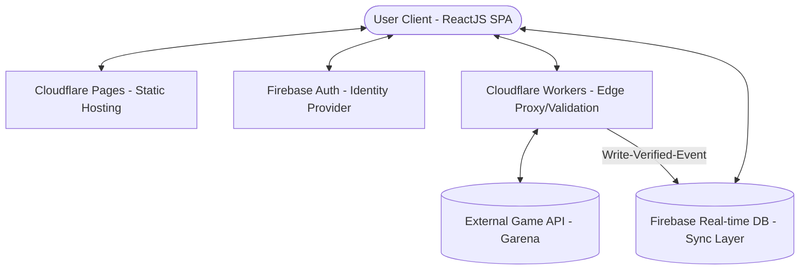

# 🌉 Delta Force Auto-Redeem Architecture (Edge-based)

Tài liệu này xác lập kiến trúc kỹ thuật của hệ thống Auto-Redeem phiên bản Web, được thiết kế theo mô hình **Serverless Edge Computing**, tối ưu hóa băng thông và độ trễ thông qua hạ tầng phân tán của Cloudflare và Firebase.

---

## 1. Sơ đồ kiến trúc tổng thể (System Topology)

---

## 2. Các thành phần kỹ thuật chi tiết (Component Specifications)

### 2.1. Client-side Application (Stateful SPA)
*   **Công nghệ:** ReactJS.
*   **Chức năng:** Phát triển theo mô hình Single Page Application (SPA). Đảm nhận việc quản lý trạng thái giao diện, thực thi logic gửi yêu cầu theo lô (Batch Processing) và duy trì bộ nhớ đệm cục bộ (Client-side Caching) để tối ưu hóa trải nghiệm người dùng.
*   **Cơ chế Delta-Sync:** Thực hiện phép so sánh tập hợp (Set Difference) giữa dữ liệu Global từ Database và lịch sử local (LocalStorage/IndexedDB) để xác định danh sách mã cần thực thi mới.

### 2.2. Edge Gateway (Proxy & Validation Layer)
*   **Công nghệ:** Cloudflare Workers.
*   **Vai trò:** Đóng vai trò lớp Gateway trung gian giữa Client và External Game API.
*   **Nhiệm vụ:** 
    *   **Bypass CORS:** Giải quyết rào cản Cross-Origin Resource Sharing của trình duyệt.
    *   **Atomic Validation:** Thực thi quy trình xác thực mã một cách nguyên tử trực tiếp từ phía Server-side.
    *   **Verification Event:** Kích hoạt lệnh ghi vào Database nếu và chỉ nếu mã được xác nhận là hợp lệ (Verified Code) từ Game API.

### 2.3. Data Synchronization Layer (Real-time DB)
*   **Công nghệ:** Firebase Realtime Database.
*   **Vai trò:** Trung tâm lưu trữ dữ liệu phân tán theo cấu trúc NoSQL JSON. 
*   **Nhiệm vụ:** 
    *   **Global Registry:** Duy trì danh sách tập trung các mã đã được xác thực bởi cộng đồng.
    *   **Event Streams:** Sử dụng cơ chế WebSocket/SSE để đẩy dữ liệu (Push) tức thì tới tất cả các Client đang kết nối khi có biến động dữ liệu (mã mới), đảm bảo tính nhất quán (Consistent) trên toàn bộ hệ thống.

### 2.4. Static Assets & Delivery (Global Edge Network)
*   **Công nghệ:** Cloudflare Pages.
*   **Vai trò:** Lớp phân phối hạ tầng tĩnh (HTML/JS/CSS). 
*   **Nhiệm vụ:** Tự động tối ưu hóa việc phân bố tài nguyên tại các điểm Edge gần người dùng nhất, giảm thiểu tối đa thời gian tải trang ban đầu (First Contentful Paint).

---

## 3. Luồng dữ liệu kỹ thuật (Architectural Data Flow)

1.  **Authentication:** Client xác thực ẩn danh thông qua Identity Provider (Firebase Auth).
2.  **Observation:** Client đăng ký Listener vào Real-time DB để nhận luồng dữ liệu (Stream) các mã Global.
3.  **Submission:** Client gửi danh sách mã chưa qua xử lý lên Edge Gateway qua phương thức HTTP POST.
4.  **Verification:** Edge Gateway thực hiện lời gọi API (Server-to-Server) đến Game API để kiểm tra tính hợp lệ.
5.  **Synchronization:** Khi mã hợp lệ, Gateway cập nhật vào Real-time DB. Trạng thái mới này tự động đồng bộ hóa ngược lại tới tất cả các Client đang hoạt động trong phiên làm việc hiện tại.
